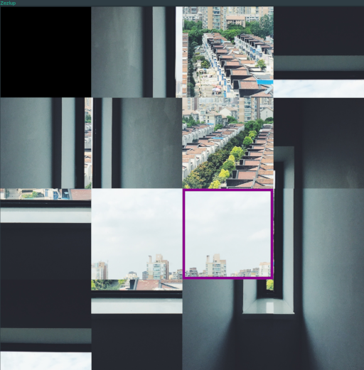

# zezlup

zezlup is a slide-puzzle game for Linux created to learn game development.

To better understand the process and its different parts, no game development libraries or tools were used.

## Build

To build zezlup:

```sh
git clone https://github.com/manekenpix/zezlup.git
cd zezlup
make release
```

## Game

To run the game:

```sh
./zezlup
```

### Menu
Use the arrow keys and enter to select an image


### Controls:
- `Arrow keys`: move selector.
- `m`: slide the selected cell into the empty cell.
- `c` (toggle): display the solution of the puzzle.
- `Esc`: Exit zezlup.


