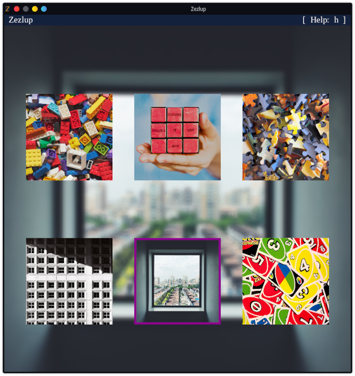
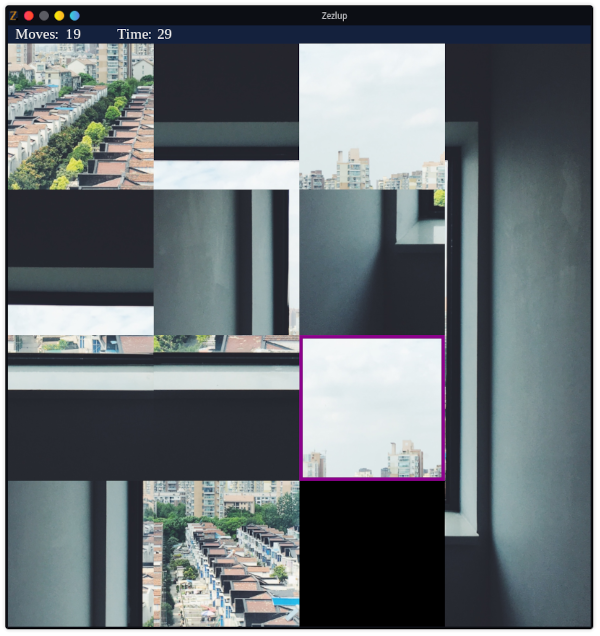
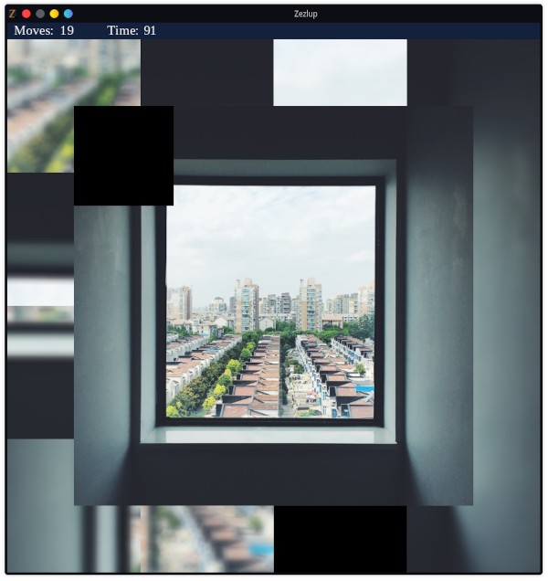

# zezlup

Zezlup is a tiny slide-puzzle game for Linux created for the sole purpose of learning a bit of game development.

To make it more fun (and also learn more), a tiny game engine was developed for this project.

## Build

### Dependencies

- [zlib](https://zlib.net/)
- [glfw](https://www.glfw.org/)
- [glew](http://glew.sourceforge.net/)
- [glm](https://github.com/g-truc/glm)
- [freetype](https://freetype.org/)

To build zezlup:

```sh
git clone https://github.com/manekenpix/zezlup.git
cd zezlup
make release
```

## Game

To run the game:

```sh
./zezlup
```

### Menu
Select the puzzle you want to solve (use your mouse or arrows and enter keys)



### Gameplay

**Controls:**
- `Arrow keys`: move selector.
- `m`: slide the selected cell.
- `c` (toggle): display the solution of the puzzle.
- `Esc`: exit zezlup.



Display the solution of the puzzle when you feel lost


